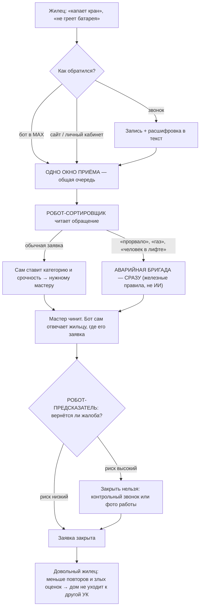

# Кейс МИФИ: предиктивная аналитика обращений в УК «КомфортДом»

> Мастер-документ решения. Собран из отчётов шести субагентов (бизнес-аналитик, solution-архитектор, программный менеджер, эксперт по предиктивной аналитике, предприниматель, дипресерчер) + идей Мари. Из него режется финальный формат сдачи (текст/PDF/презентация — по требованиям МИФИ).

## Параметры кейса (дано)

| Параметр | Значение |
|---|---|
| Обращений в месяц | 14 000 |
| Доля обращений, требующих ручной сортировки | 71% |
| Среднее время первичной реакции | 2,5 часа |
| Доля повторных жалоб по одной проблеме | 16% |
| Доля обращений с низкой оценкой качества | 11% |
| Доступные данные | обращения, статусы, оценки жильцов, история заявок |
| Бюджет | до 2,5 млн ₽ на 5 месяцев |

---

## Красная нить решения

1. **Сначала процесс, потом модель.** 70–80% проблемы «2,5 часа реакции» снимается в первый месяц без ИИ: автоподтверждение заявки, правила-триггеры на аварийные слова («прорвало», «застрял», «газ»), SLA-таймер с автоэскалацией. Это очищает замер: дальше видно, что добавила именно модель.
2. **ИИ может только повышать срочность, никогда не понижать.** Аварийные категории (вода, газ, человек в лифте) обрабатываются детерминированными правилами, модель к ним не допускается. Это ответ и на главный риск (ошибка на критичной заявке = ЧП), и на регуляторику: по постановлению № 416 у АДС норматив реакции 5–10 минут и локализация аварии за 30 минут — текущие 2,5 часа юридически опасны.
3. **Прогноз, не меняющий ничьих действий, стоит ноль.** Скоринг риска повтора существует только вместе с регламентом: топ-10% рисковых заявок нельзя закрыть без контрольного звонка или фотоотчёта. Модель — датчик, проект — про изменение процесса.
4. **Один вход — одна очередь — один источник правды.** Звонки, бот, веб сводятся в единую очередь с единым ID обращения и единой витриной данных. Пока каналы живут раздельно, 71% ручной сортировки неустраним, а данные для ML — мусор. (Слой идей Мари: централизованный сбор, единая таблица, единый источник распределения.)

---

## Целевая архитектура (интеграция идей Мари)

### Каналы входа → единая очередь

- **Телефон**: запись + расшифровка (speech-to-text) → текст звонка попадает в ту же очередь, что и чаты. Канал перестаёт быть чёрной дырой: звонок классифицируется тем же конвейером, копится корпус для дообучения, появляется контроль качества диспетчеров. Юридически: уведомление «разговор записывается…» в начале звонка (формулировка — в юрразделе).
- **Бот в MAX**: приём обращений кнопками (категория, адрес из профиля) + статус заявки по запросу. Обращение из бота приходит уже структурированным — снижает нагрузку на классификатор и даёт чистые данные. Ход усиливается статусом MAX как национального мессенджера (предустановка, Госуслуги-логин) — жюри это считает.
- **Веб-ассистент** (референс — ассистент Госуслуг): ИИ-чат на сайте/в ЛК с базой знаний по текущим статусам (RAG поверх витрины данных). Мгновенный первый ответ 24/7 — прямой удар по метрике «2,5 часа». Отвечает «по вашему дому уже открыта заявка №…, срок — …» — гасит обращения-дубли (часть тех самых 16% повторов — это «а что там с моей заявкой?»). Guardrail: аварийные слова = мгновенная эскалация на человека, ассистент никогда не удерживает аварию в чате.

### Единая витрина данных («единая таблица пересечений и зависимостей»)

Мастер-витрина: обращение ↔ заявка ↔ адрес/дом ↔ исполнитель/бригада ↔ статусы ↔ оценка ↔ связка «повтор ↔ исходная заявка» (восстанавливается эвристикой: адрес + категория в окне 30 дней, проверка на окнах 14/45). Витрина — фундамент трёх вещей сразу: признаки для моделей, база знаний ассистента, дашборд руководства.

### Два контура ИИ (ответ на ограничение «152-ФЗ + РФ-модели слабее»)

- **Контур А — общение и поток (сырые ПД, периметр РФ).** Классификация обращений, диалоги ассистента, суммаризация звонков. Модели: открытые веса мирового уровня (DeepSeek / Qwen) на российском хостинге (Yandex Cloud AI Studio / Cloud.ru и др.) — качество frontier-класса без трансграничной передачи; альтернатива/дубль — GigaChat / YandexGPT API. Данные не покидают РФ → 152-ФЗ чисто.
- **Контур Б — аналитика и разработка (только обезличенные данные).** Deep-research по истории заявок, генерация правил, разметка сложных случаев, код. Модели: frontier (Claude Opus / аналог) через **шлюз деперсонализации**: NER-вычистка ФИО/телефонов/адресов (регэкспы + лёгкая NER-модель), замена на токены вида [АДРЕС_1]; словарь соответствий не покидает периметр УК.
- Прогноз повторов — вообще не LLM: бустинг (CatBoost) на табличных признаках витрины, работает на CPU внутри периметра.

Почему не «просто DeepSeek по API»: прямой вызов китайского API с сырыми обращениями — трансграничная передача со всеми рисками (уведомление РКН, возможный запрет, оборотные штрафы за утечку); при этом та же модель на российском хостинге стоит копейки и снимает вопрос полностью. Цифры и юридические детали — ниже в фактуре.

### Оператор службы заботы с ИИ (35–50 тыс. ₽/мес, удалённо)

Выделенная роль вместо «размазанной» нагрузки на диспетчеров: разбирает то, в чём ИИ не уверен (эскалация по порогу уверенности), ведёт контрольные звонки по топ-10% рисковых заявок (регламент из блока предиктивной аналитики), валидирует разметку. За 5 месяцев проекта: 175–250 тыс. ₽ — влезает в бюджет. Побочный эффект: снимает риск «саботажа диспетчеров» — никого не заменяем, добавляем сервисную роль.

---

## Блок-схема решения (простая)

Путь одной заявки:

Стройка за 5 месяцев, одной строкой на месяц: **М1** — наводим порядок и снимаем быстрые победы (первые результаты через 3 недели) → **М2** — робот молча читает и учится (теневой режим) → **М3** — робот начинает сортировать сам + появляется предсказатель → **М4** — предсказания меняют процесс закрытия заявок → **М5** — меряем деньги и решаем: масштабировать.

---

## Блок 1. Бизнес-цели и показатели успеха

Четыре SMART-цели (горизонт — конец М5 / +3 мес. после):

1. Ручная сортировка: 71% → **≤30%** (stretch 20–25%).
2. Первичная реакция: **p90 ≤ 60 мин** (сейчас среднее 2,5 ч; среднее скрывает хвост — целимся в p90); цифровые каналы — первый содержательный ответ **<1 мин** (ассистент); аварийные — по нормативам АДС (ПП № 416).
3. Повторные жалобы: 16% → **≤12%** (цель второго года 8–10%).
4. Низкие оценки: 11% → **≤8,5%**.

North star: **доля здоровых обращений** (закрыто без повтора и без низкой оценки) 75% → 80%.

Трёхуровневое дерево метрик: модельные (macro-F1 ≥ 0,85; recall по критичным ≥ 0,95; для скоринга повторов — precision@top-10%, lift ×2,5–3) → операционные (доля автомаршрутизации, p90 времени реакции, доля обращений через цифровые каналы, доля звонков с расшифровкой) → бизнесовые (четыре цели выше + north star). Причинные цепочки между уровнями прописаны: точность классификации → скорость маршрутизации → время реакции → повторы/оценки.

Guardrails: пропуск критичной заявки ≤0,5%; возвраты из авто-очереди ≤10%; CSAT авто-обработанных не хуже ручных; для ассистента — доля некорректных ответов по статусам ≤2% (выборочный аудит).

Обоснование выбора: accuracy сама по себе обманчива (константа «не повторится» даёт 84% при полной бесполезности — дисбаланс 1:5); повторы запаздывают на 4–8 недель → нужны leading-метрики операционного уровня.

## Блок 2. Данные, технологии, ограничения

**Данные и дыры (честно):** связка «повтор ↔ исходная заявка» не ведётся — восстанавливаем эвристикой; категории неконсистентны — нормализация LLM-предразметкой; расшифровок звонков нет — закрывается записью+STT из архитектуры; оценки жильцов смещены (ставят злые) — учитываем в интерпретации.

**Стратегия: гибрид в три шага.**
1. Старт (недели 1–4): LLM по API из российского контура + правила. Предразметка истории (нормализация категорий, разметка выборки).
2. Дистилляция (М2–М3): обучение лёгкой своей модели (rubert-tiny2 + CatBoost) на предразметке — инференс на CPU, независимость от вендора.
3. Прогноз повторов: бустинг на табличных признаках витрины (топ-фичи: повторы по адресу за 90 дней, просрочка SLA, доля повторов бригады, категория×сезон). Обязательный бейзлайн — простое правило («был повтор по этому адресу за 90 дней»): модель обязана его бить, иначе ML в этой части не нужен.

**Экономика инференса:** весь поток 14 000 обращений/мес ≈ 17 тыс. ₽/мес на российском хостинге (DeepSeek V4 Flash @ Yandex AI Studio) + расшифровка звонков ≈ 19 тыс. ₽/мес — ИИ-инфраструктура <2% бюджета. Деньги проекта уходят на людей и интеграцию, а не на «ИИ».

**Ограничения проекта:**
- 152-ФЗ: ПД жильцов → контур РФ; зарубежные API — только за шлюзом обезличивания (юрфактура ниже).
- Российские модели слабее frontier — но для классификации и статусных диалогов хватает с запасом; там, где нужен frontier-интеллект (анализ, генерация правил), он используется на обезличенных данных.
- Потолок эвристики таргета «повтор» — точность связки ограничена качеством адресов.
- У диспетчерской системы может не быть API — обход: регулярные выгрузки/RPA (проверяется в первые 2 недели).
- Разметка силами диспетчеров — медленная; компенсация: LLM-предразметка + оператор заботы как валидатор.
- Intervention bias: когда регламент топ-10% заработает, метки начнут «портиться» — контрольная группа 5–10% обязательна.

## Блок 3. План, риски, экономика

### Помесячный план (сжат по идее Мари: первые результаты через 3 недели)

- **М1, недели 1–2 — deep-research-аудит вместо классического месячного.** ИИ-EDA всей истории + LLM-разбор выборки 500–1000 обращений: реальная структура категорий, частота повторов по эвристике, качество данных. Параллельно: юрподготовка (уведомление о записи звонков, политика обезличивания, проверка уведомления РКН об обработке ПД), витрина данных v0.
- **М1, недели 3–4 — quick wins в бою:** автоподтверждение с номером заявки, правила-триггеры аварий, SLA-таймер, запись звонков включена, бот MAX v0 (приём + статус). **Gate 1:** quick wins живут, витрина v0 собрана, первые цифры руководству — через 3 недели.
- **М2 — конвейер:** расшифровка звонков потоком; классификатор v1 (LLM росс. контура + предразметка истории) в теневом режиме на 1 ЖК; лайт-ассистент (статус по номеру заявки). **Gate 2:** macro-F1 ≥ 0,80 в тени; ≥60% обращений проходят через единую очередь.
- **М3 — своя модель + скоринг:** дистилляция в лёгкую модель; частичная автомаршрутизация простых категорий; скоринг повторов v1 в тени; полный ассистент (RAG по статусам) на пилотном ЖК. **Gate 3:** macro-F1 ≥ 0,85; recall критичных ≥ 0,95; lift скоринга ≥ ×2 в тени.
- **М4 — процесс вокруг прогноза:** регламент топ-10% (контрольный звонок оператора заботы / фотоотчёт перед закрытием); контрольная группа 5–10%; расширение автомаршрутизации. **Gate 4:** регламент исполняется ≥90%; guardrails не нарушены.
- **М5 — итоги и решение:** A/B-замер эффекта, экономика по факту, передача эксплуатации, решение о масштабировании + roadmap (в т.ч. SaaS-надстройка).

**Кадры без ML-команды:** middle DS + инженер на аутсорсе part-time (гейт-оплата по результатам этапов), владелец продукта внутри УК (существующий сотрудник, ~30% времени), оператор службы заботы (удалённо), диспетчеры как разметчики с доплатой.

**Бюджет 2,5 млн ₽ (ориентир, пересчитан по фактическим ценам 25.08.2026):** подрядчик-разработка 1,25 / интеграция + бот MAX + веб-ассистент 0,45 / оператор заботы (5 мес) 0,225 / резерв 0,225 / API LLM + STT 0,15 / разметка (доплаты) 0,10 / обучение и регламенты 0,10. Статья API+STT удвоена против первого черновика: инференс ~17 тыс. ₽/мес (РФ-хостинг) + расшифровка ~19 тыс. ₽/мес.

### Риски (7)

1. **Ошибка на критичной заявке** → детерминированные правила-периметр, принцип «только повышать срочность», guardrail ≤0,5%, еженедельный аудит пропусков.
2. **Качество данных хуже ожиданий** → аудит в первые 2 недели (не в конце), эвристика таргета с проверкой на окнах 14/45, витрина как форсинг-функция чистки.
3. **Сопротивление диспетчеров** → никого не сокращаем в пилоте, доплата за разметку, метрики «облегчения» (сколько рутины сняли), быстрые победы в первый месяц, оператор заботы как отдельная роль.
4. **152-ФЗ / трансграничка / утечка** → контур ПД в РФ, шлюз обезличивания для frontier, уведомление о записи звонков, минимизация ПД в витрине; аргумент дисциплины — оборотные штрафы за утечки (с 30.05.2025).
5. **Вендор-лок** → открытые веса переносимы между хостингами, дистилляция в свою модель к М3, данные и разметка — собственность УК.
6. **Сезонный дрейф** (отопительный сезон меняет структуру обращений) → мониторинг качества по неделям, дообучение по расписанию, временной сплит в валидации (не random).
7. **Срыв сроков/качества подрядчиком** → gate-оплата, зафиксированный MVP-скоуп, резерв 10%, права на код и данные у УК.

### Экономика

Консервативный расчёт — все допущения явные, проверяются аудитом М1:

- **Повторы:** 16% → 12% = −4 п.п. × 14 000 × 12 мес ≈ 6 700 предотвращённых повторов/год; из них ~70% с выездом бригады (допущение: не каждое обращение порождает заявку с выездом — уточняется в аудите) × ~1 300 ₽ за выезд ≈ **6,0 млн ₽/год**.
- **Сортировка:** −41 п.п. × 14 000 ≈ 5 700 обращений/мес уходят из ручной сортировки × ~4 мин ≈ 2,3 ставки диспетчера × полная стоимость ставки ≈ **1,7 млн ₽/год**.
- Итого эффект ≈ **7,7 млн ₽/год** против 2,5 млн проекта + ≈1,2 млн/год эксплуатации (оператор заботы 0,54 + LLM и STT ≈0,44 + поддержка ≈0,2) → **окупаемость — ~10-й месяц от старта (нарастающим итогом), ROI первого полного года эксплуатации ≈ +110%**. Чувствительность: при эффекте вдвое ниже — окупаемость ~20 мес., проект в плюсе. Мягкие эффекты (NPS, удержание домов, снижение штрафных рисков по 416-ПП) в ROI не смешиваются — идут отдельным списком как апсайд.

Атакуемая проблема по агрессивной оценке (слой предпринимателя): повторные выезды — статья 20–30 млн ₽/год; один ушедший дом = −7 млн ₽/год выручки (уходят на собраниях собственников, куда жильцов приводят те самые 16% повторов).

### Критерии масштабирования (6+1)

1. Gate-метрики достигнуты и держатся ≥8 недель.
2. Фактическая экономика ≥50% расчётной (по A/B).
3. Guardrails не нарушались 8 недель подряд.
4. Регламент топ-10% живёт без ручного пинка (исполнение ≥90%).
5. Подключение нового ЖК ≤2 недель работ.
6. CSAT/NPS пилотного ЖК не ниже контрольных.
7. (SaaS-критерий) Мультитенантность заложена, обезличенный датасет копится с М1 — через год систему можно предлагать другим УК (в РФ ~20 тыс. УК с идентичными болями).

---

## Слой предпринимателя (смелая надстройка — отдельным разделом в финале)

- Переворот фокуса: руководство целится в ФОТ на сортировке (~4–5 млн/год), а деньги — в повторных выездах (20–30 млн/год) и удержании домов.
- Проект как актив: мультитенантность + обезличенный датасет с первого дня (стоит почти ноль) → через год SaaS для рынка УК. Красиво отвечает на «критерии масштабирования».
- 7 жёстких вопросов руководству до старта и красные флаги, при которых проект = выброшенные 2,5 млн.

## Козыри актуальности (из ресерча)

- Минстрой: цель «75% обращений в ЖКХ через ИИ к 2030» (Forbes, май 2026).
- Кейс Домиленд × А101: 32% заявок закрывает ИИ-ассистент (24.08.2026) — прямой референс нашего веб-ассистента.
- Только 19% УК используют ИИ (Doma.ai) — «КомфортДом» в раннем большинстве.
- Московский ЕДЦ автоматизирует ~30% — наши цели честные, не вендорские «80–90%».
- Точность ИИ-классификации обращений Минюста 0,84–0,89 — якорь для нашего порога ≥0,85.

## Трассировка идей Мари → куда встали

| Идея | Куда встала |
|---|---|
| 1. Deep research по истории заявок | М1 недели 1–2: ИИ-аудит вместо классического месячного (контур Б, обезличенно) |
| 2. Единая таблица пересечений и зависимостей | «Единая витрина данных» — фундамент моделей, ассистента и дашборда |
| 3. Централизованный сбор (звонки / бот в MAX) | Архитектура каналов → единая очередь; бот MAX в М1 (v0) |
| 4. Запись звонков и расшифровка | М1 (запись) → М2 (STT-поток); закрывает дыру «нет расшифровок» из блока 2 |
| 5. Единый источник для распределения | Тезис №4 красной нити + единая очередь с единым ID |
| 6. ИИ-ассистент в вебе со статусами | М2 (лайт) → М3 (RAG по витрине); референсы Госуслуги и Домиленд×А101 |
| Стек: DeepSeek для общения | Да, но на российском хостинге (контур А) — качество без трансграничной передачи |
| Стек: Claude Opus + деперсонализатор | Контур Б: frontier только за шлюзом обезличивания |
| Оператор с ИИ 35–50 тыс./мес | Роль «оператор службы заботы»: эскалации, контрольные звонки топ-10%, валидация разметки |
| Анализ за 2 недели, результаты через 3 | План М1 сжат: аудит недели 1–2, quick wins недели 3–4; gate не отменяем |

---

## Фактура (заполняется по отчётам ресерчеров 25.08.2026)

### Цены и технологии (проверено ресерчером 25.08.2026)

- **DeepSeek v4 flash существует** (Мари права): актуальная дешёвая модель DeepSeek, контекст 1M. Официальные цены API: вход $0,44/1M (cache miss, peak) / $0,22 off-peak; кэшированный вход $0,014/$0,007; выход $1,32/$0,66 за 1M. Тарифы с 16.08.2026. Источник: api-docs.deepseek.com/quick_start/pricing. Есть deepseek-v4-pro ($1,32 вход / $3,96 выход peak). Курс: 83 ₽/$.
- **Расчёт на 14 000 обращений/мес** (классификация всех + диалоги ассистента у 40%): ≈52,1M токенов/мес (44,8M вход + 7,3M выход). Прямой DeepSeek API: ~$29/мес ≈ **2 430 ₽/мес** (peak, без кэша; off-peak вдвое дешевле; консервативная вилка ×2 ≈ 4 900 ₽/мес; годовой максимум ~58 тыс. ₽).
- **Российский хостинг (главный вывод):** DeepSeek V4 Flash официально доступен в **Yandex AI Studio с 28.05.2026** — первая в РФ облачная модель с контекстом 1M. Цены: 300 ₽/1M вход, 500 ₽/1M выход, 75 ₽/1M кэш. Наш объём ≈ **17 тыс. ₽/мес** (вилка ×2 ≈ 34 тыс.). Оплата по счёту юрлица в ₽. Также Cloud.ru Evolution (DeepSeek V4 Pro/Flash, GLM-5.1, Kimi K2.6, с 06.2026), Selectel (30+ моделей, тарификация за GPU-ресурсы). Премия за РФ-хостинг ~×7 к прямому API, но в абсолюте незначима. Своё железо отклонено: минимальный GPU-набор под крупную LLM — 38–55 млн ₽ (MWS/ComNews, 08.2026).
- **Claude API:** Opus 5 — $5/$25 за 1M (вход/выход), Sonnet 5 — $2/$10, кэш 10% цены входа, Batch −50%. РФ отсутствует в списке поддерживаемых стран Anthropic (проверено 25.08.2026) — прямая оплата не работает; легально — через агрегаторы (OpenRouter: цены без наценки, комиссия пополнения ~5–5,5%) или реселлеров по счёту в ₽. Для продакшна УК — только на обезличенных данных; в базовом контуре не используется.
- **STT:** Yandex SpeechKit — 0,60 ₽/мин (асинхронное распознавание, двухканальная запись звонка = одна единица); SaluteSpeech — те же 0,60 ₽/мин, но с 15.07.2026 новым клиентам только договорные условия. Объём 8 000 звонков × 4 мин = 32 000 мин ≈ **19,2 тыс. ₽/мес** (~230 тыс. ₽/год).
- **MAX:** >125 млн зарегистрированных (07.2026), в июле 2026 впервые обошёл Telegram по месячной аудитории в РФ; предустановка обязательна с 01.09.2025; интеграция с Госуслугами и СБП. **Открытый Bot API есть** (dev.max.ru/docs-api, регистрация через @MasterBot, Python-библиотека maxapi), есть Mini Apps. Готовые ЖКХ-кейсы: интеграция «1С:Сайт ЖКХ» с ботом MAX, чат-боты оплаты ЖКУ и передачи показаний. Референс UX — робот Макс на Госуслугах: с 02.2026 на генеративном ИИ, **две российские LLM на конкурентной основе + RAG строго из доверенной базы знаний** — ровно наша архитектура ассистента.

### Юридический бриф (152-ФЗ)

- Трансграничная передача (Китай/США, процедура, риски): {{TODO}}
- Обезличивание и схема со шлюзом (233-ФЗ с 01.09.2025): {{TODO}}
- Запись звонков: условия и формулировка: {{TODO}}
- Штрафы 2025–2026 (оборотные за утечки, трансграничка): {{TODO}}
- Готовая юр-рамка для кейса: {{TODO}}

---

## Открытые вопросы

1. Формат сдачи МИФИ (текст/PDF/презентация, лимит объёма) и дедлайн — определяет финальную сборку.
2. Есть ли у «КомфортДом» (по легенде кейса) собственная диспетчерская система с API — влияет на статью «интеграция».
3. Решение по разногласиям агентов зафиксировано: сортировка ≤30% (stretch 20–25%), повторы ≤12% (8–10% год-2), консервативный ROI в основе, аудит сжат до 2 недель.
